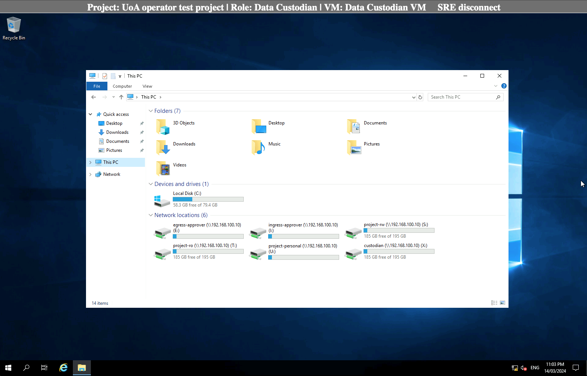

# As a Data Custodian 

## Log into SRE  

Open browser and use the [SRE URL/domain](https://sre.nectar.auckland.ac.nz/)  

In the log in page, enter UPI, password and Authy token.

You will see the following landing page. Choose “Virtual Desktops” if you need to analyse your data. Follow the instructions under "Analysing Data" for the Researcher as above. 

<figure markdown>
  
  <figcaption> </figcaption>
</figure>

<figure markdown>
  
  <figcaption> </figcaption>
</figure>

In the Research VM, the following list of folders are available to a data custodian: 

Project-rw 

Project-ro 

Project-personal (of all users in the project)

Custodian

Egress approver 

Ingress approver 

<figure markdown>
  
  <figcaption> </figcaption>
</figure>

## Ingress data directly into SRE 

A data custodian can import (ingress) data directly into SRE without requiring approval from the ingress approver.  

For this, in the main menu select “Data Ingress” and “choose the file” to be uploaded and click on “Upload”. This copies your file from your computer/storage device to the airlock.  

<figure markdown>
  
  <figcaption> </figcaption>
</figure>

Select “Request ingress” to move the file from the airlock to “Custodian” folder. The request state in the “ingress request history” changes from “creating” to “completed”. 

You will also receive two notifications in your email - your file has been uploaded and then that it has been processed. 

## Egress data out of SRE

As a data custodian to download data from the project’s SRE, login to SRE main menu and open the Data Custodian VM under Virtual Desktops.  

## Deletion of datasets 

As a data custodian, you have read and write access to every folder in your project in an SRE. You may delete data from user’s personal, custodian, ingress-approver, egress-approver, project-ro and project-rw folders. 

## Request for change of user’s role/permission level 

As a data custodian, you can request for a specific user’s role to be changed in your project or give them a different permission level (read-write or read-only) in SRE. For this, please send an email to the SRE team. 

## Request to remove a user from a project 

As a data custodian, you can request for a specific user to be added or deleted from your project in SRE. Please send an email to the SRE team with the users' details – full name, UPI, email and role in SRE (researcher/data custodian/ingress-approver/egress-approver). 
