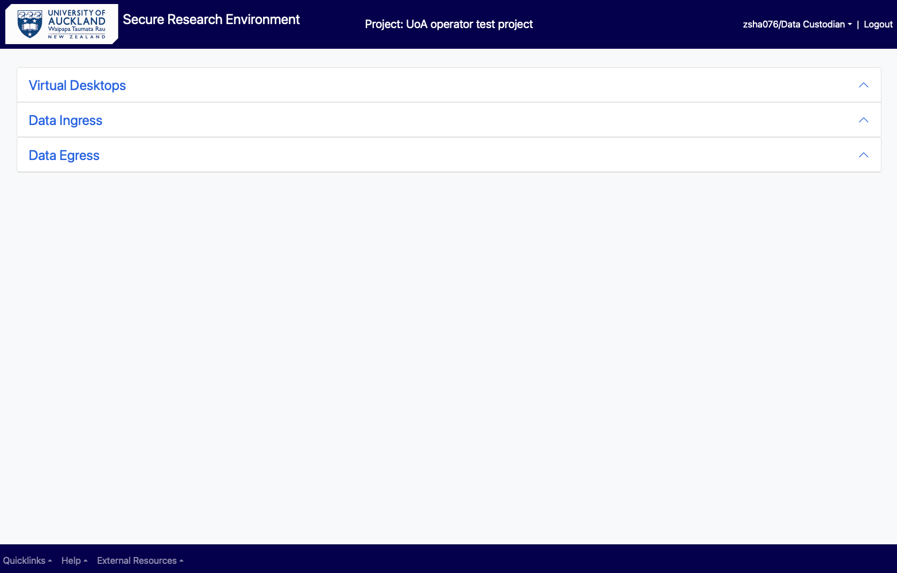

# As a Data Custodian 

## Log into SRE  

Open browser and use the [SRE URL/domain](https://sre.nectar.auckland.ac.nz/)  

In the log in page, enter UPI, password and Authy token.

You will see the following landing page. Choose “Virtual Desktops” if you need to analyse your data. Follow the instructions under "Analysing Data" for the Researcher as above. 

<figure markdown>
  
  <figcaption> </figcaption>
</figure>

<figure markdown>
  
  <figcaption> </figcaption>
</figure>

In the Research VM, the following list of folders are available to a data custodian: 

Project-rw 

Project-ro 

Project-personal (of all users in the project)

Custodian

Egress approver 

Ingress approver 

<figure markdown>
  
  <figcaption> </figcaption>
</figure>

## Ingress data directly into SRE 

A data custodian can import (ingress) data directly into SRE without requiring approval from the ingress approver.  

For this, in the main menu select “Data Ingress” and “choose the file” to be uploaded and click on “Upload”. This copies your file from your computer/storage device to the airlock.  

<figure markdown>
  
  <figcaption> </figcaption>
</figure>

Select “Request ingress” to move the file from the airlock to “Custodian” folder. The request state in the “ingress request history” changes from “creating” to “completed”. 

You will also receive two notifications in your email - your file has been uploaded and then that it has been processed. 

## Egress (export) data out of SRE

As a data custodian to download data from the project’s SRE, login to SRE main menu and open the "Data Custodian VM" under "Virtual Desktops".  

<figure markdown>
  
  <figcaption> </figcaption>
</figure>

In the virtual machine, open the File explorer and select “custodian” folder under network locations. Select your personal “custodian” folder (if there are multiple data custodians in your project).  

<figure markdown>
  
  <figcaption> </figcaption>
</figure>

There are two subfolders available, select the “egress” subfolder and copy the data to be egressed in here.  

<figure markdown>
  
  <figcaption> </figcaption>
</figure>

> [!NOTE]
> All the files in this “egress” folder will be copied to be downloaded when a request is submitted. Therefore, if you have data from an earlier egress request in this folder, please delete it before submitting a new request.  

Switch back to the SRE main menu, select the Data Egress option, and click on the “Request Egress” button.  

<figure markdown>
  
  <figcaption> </figcaption>
</figure>

As a data custodian, the egress request will be approved and completed, and the file is made available for downloading bypassing the review process. A notification of the same would be received by the data custodian/s. 

Click on the zip file link under the “Files available for download” to download the zipped-up folder. Next go to your local computer’s download folder and double click on the zipped file.  

<figure markdown>
  
  <figcaption> </figcaption>
</figure>

Click on the arrow next to “Unzip to” tab, provide appropriate location and select “Unzip”. 

<figure markdown>
  
  <figcaption> </figcaption>
</figure>

<figure markdown>
  
  <figcaption> </figcaption>
</figure>

The downloaded file/s can be found in the “egress” folder in this location. All the future unzipped egress files will be in this folder. 

<figure markdown>
  
  <figcaption> </figcaption>
</figure>

## Deletion of datasets 

As a data custodian, you have read and write access to every folder in your project in an SRE. You may delete data from user’s personal, custodian, ingress-approver, egress-approver, project-ro and project-rw folders. 

## Request for change of user’s role/permission level 

As a data custodian, you can request for a specific user’s role to be changed in your project or give them a different permission level (read-write or read-only) in SRE. For this, please send an email to the SRE team. 

## Request to remove a user from a project 

As a data custodian, you can request for a specific user to be added or deleted from your project in SRE. Please send an email to the SRE team with the users' details – full name, UPI, email and role in SRE (researcher/data custodian/ingress-approver/egress-approver). 
