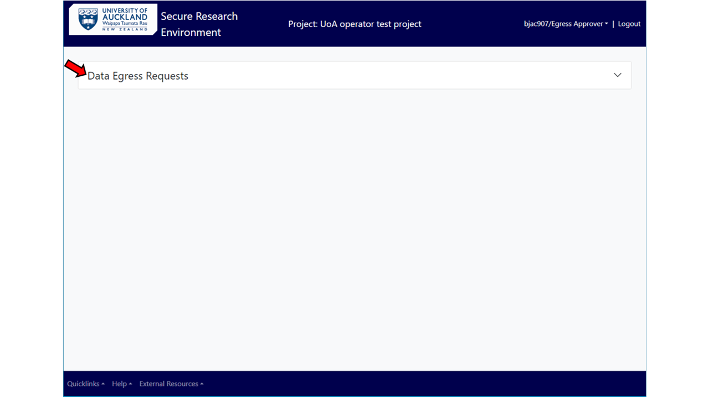
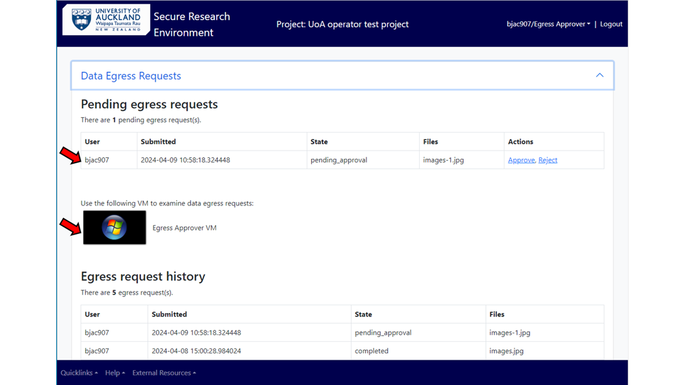
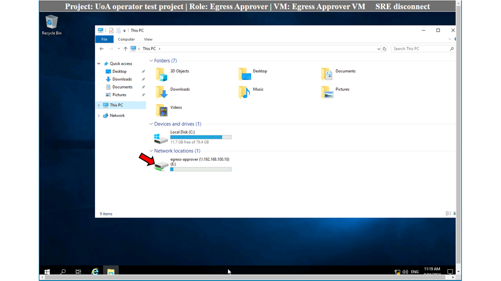
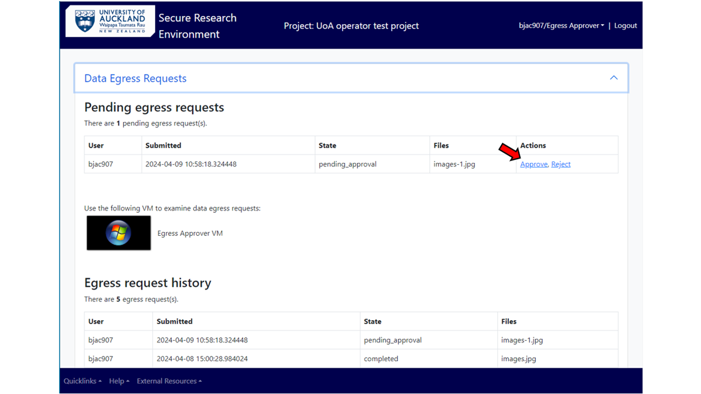
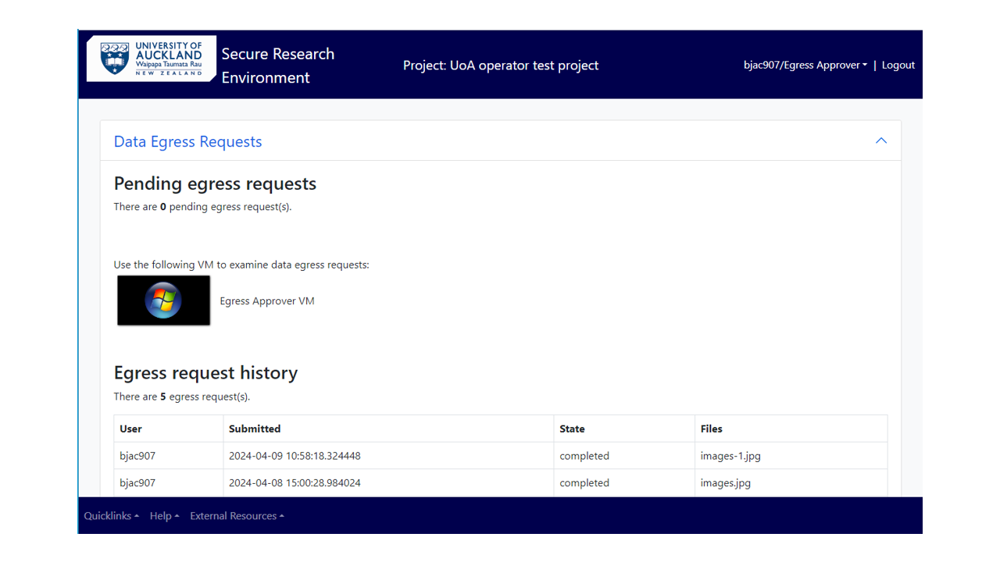

# As a Data Egress Approver

Login into SRE and if needed, change to “Egress approver” role. 

## View egress requests 

Upon getting the notification to review an egress request, the user must either log in to SRE environment as an Egress Approver or needs to select and change the role in SRE. 

Select Data Egress Request from the screen. 

<figure markdown>
  
  <figcaption> </figcaption>
</figure>

You can see the pending requests by different users waiting to be reviewed. You can use the virtual machine (Egress Approver VM) available to view and evaluate the data that has been requested to be taken out of the project’s SRE

<figure markdown>
  
  <figcaption> </figcaption>
</figure>

In the virtual machine, open the File explorer and select “egress-approver” folder under network locations. 

<figure markdown>
  
  <figcaption> </figcaption>
</figure>

From the list of folders, select the user who requested the data egress, and open the requested file (filenames are time-stamped) to inspect the contents.  

## Approve or decline a request

After inspection, go back to the previous main menu (Data Egress Requests) and approve or reject the ingress request, as seen appropriate.  

<figure markdown>
  
  <figcaption> </figcaption>
</figure>

When the request is “approved” or “rejected”, the egress request is removed from the Pending egress requests. On approval, the state of the request changes to “completed” in the Egress request history.  

<figure markdown>
  
  <figcaption> </figcaption>
</figure>

Please get in touch with the researcher if the request is rejected and provide them with advice for the next steps. 
