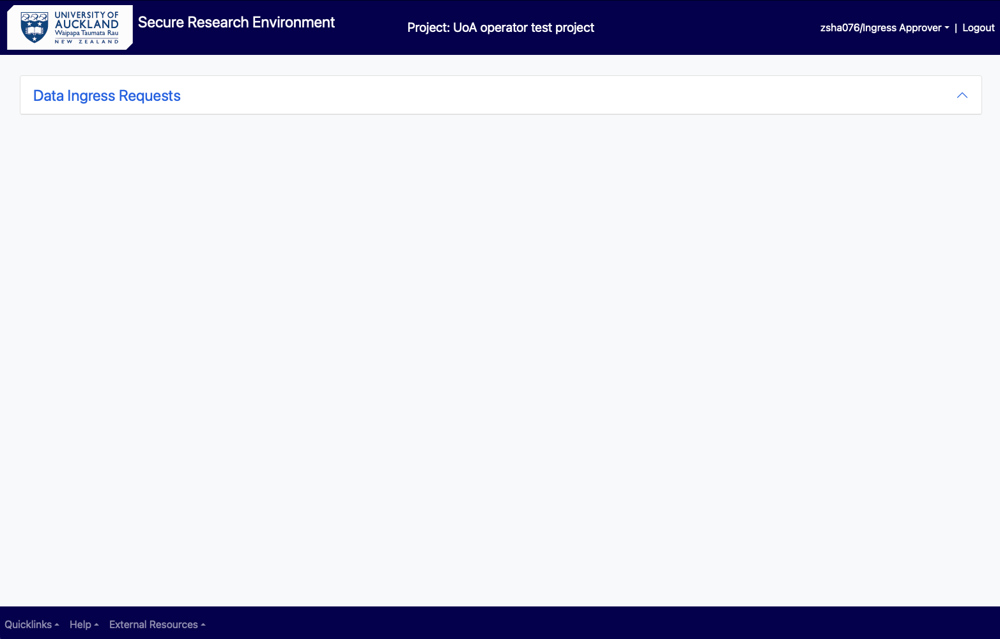
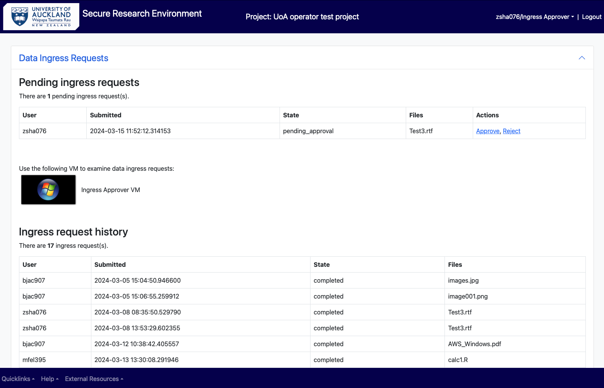
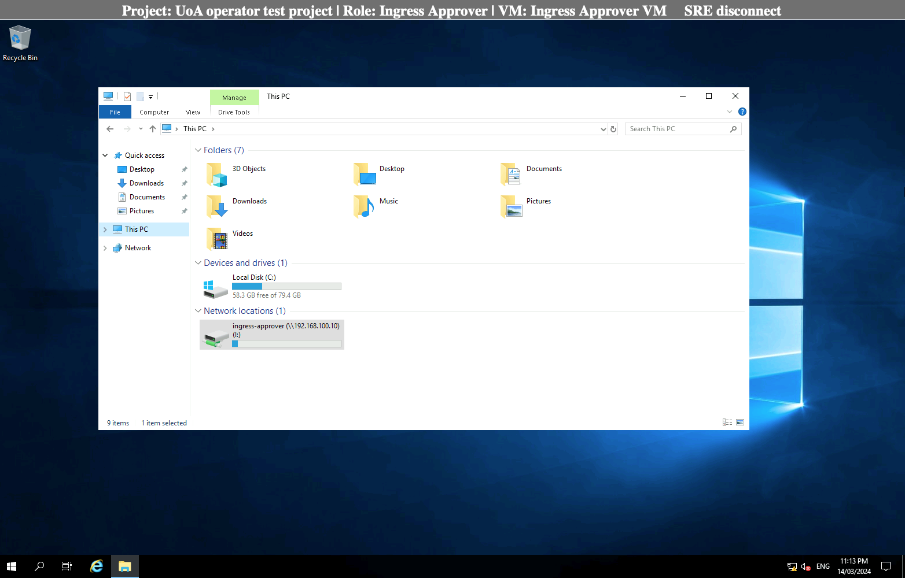

# As a Data Ingress Approver 

Login as in section () or change to “Ingress approver” role (section) 

## View ingress requests 

Upon getting the notification to review an ingress files request, the user must either log in to SRE environment as an Ingress Approver/Data custodian or needs to select and change the role in SRE.  

Select Data Ingress Request from the screen.  

<figure markdown>
  
  <figcaption> </figcaption>
</figure>

You can see the requests by different users which are waiting to be approved.  You can use the virtual machine available to view and evaluate the data been requested to be brought in. 

<figure markdown>
  
  <figcaption> </figcaption>
</figure>

In the virtual machine, open the File explorer and select “ingress-approver” folder under network locations. 

<figure markdown>
  
  <figcaption> </figcaption>
</figure>

From the list of folders, select the user who requested the ingress, and open the requested file to inspect the contents.  

## Approve or decline a request 

After inspection, go back to the previous main menu (Data ingress requests) and approve or reject the ingress request, as seen appropriate. The data will be automatically deleted from the ingress approver folder (airlock) following approval/rejection. If the request is approved, you will find the file in your personal storage (folder) in the “ingress” folder. 