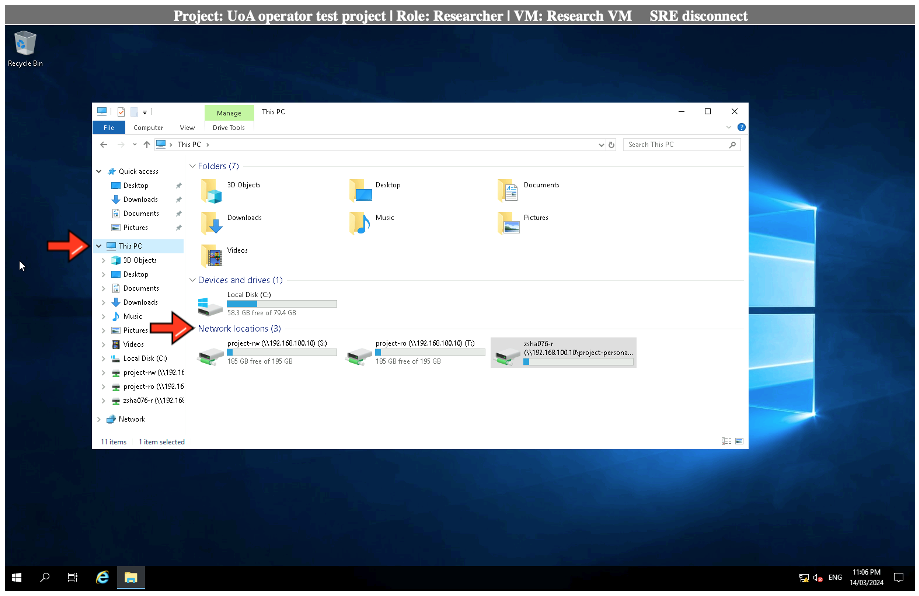
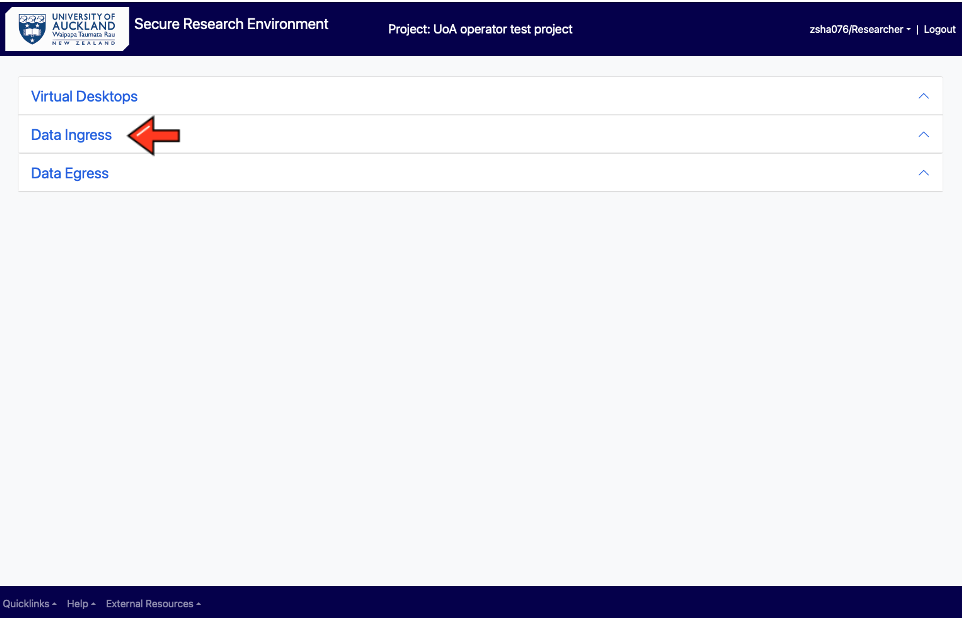
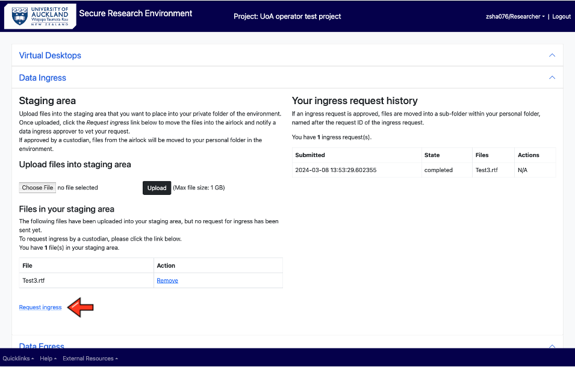
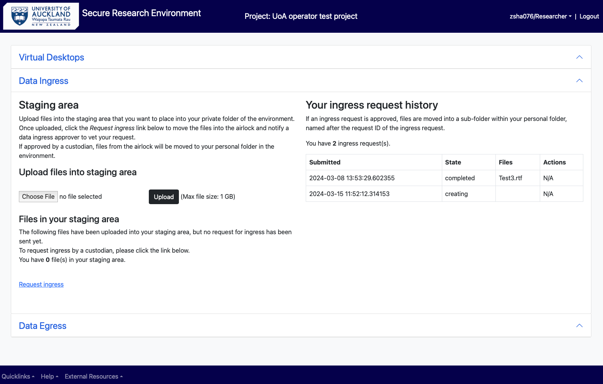
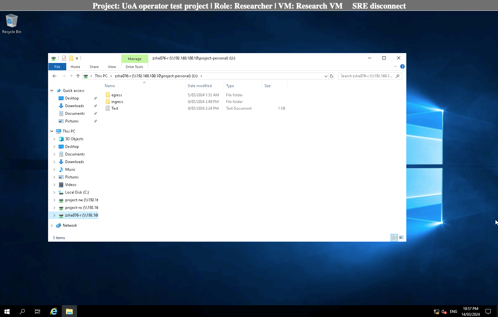
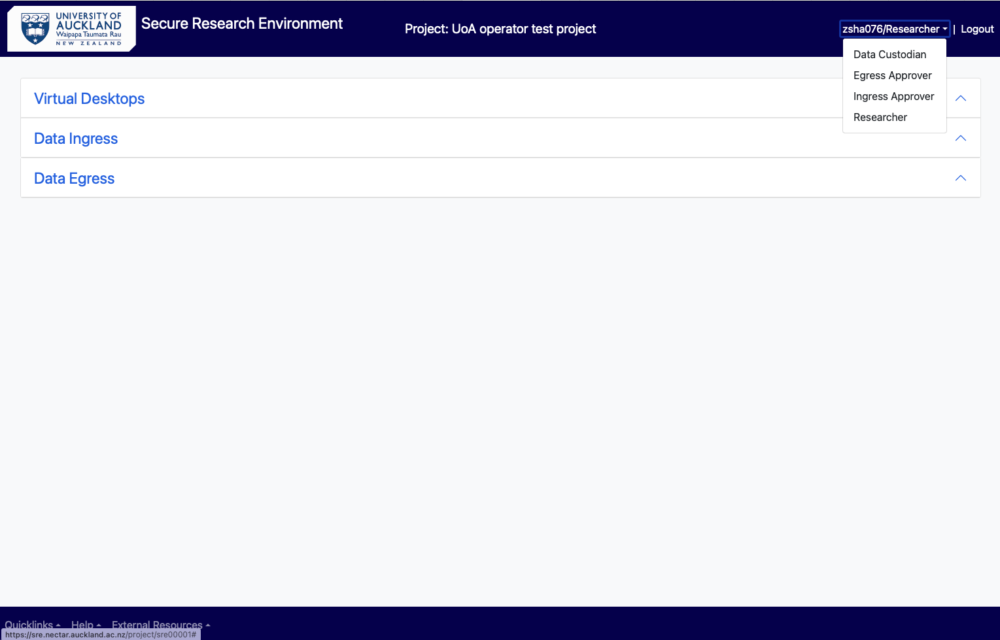

# As a Researcher

## Log into the SRE 

Open browser and use the following [SRE URL/domain](https://sre.nectar.auckland.ac.nz/)  

In the log in page, enter your UPI and password.

Enter MFA (authy token).

You will be directed to the On-prem SRE landing page. 

<figure markdown>
  
  <figcaption> </figcaption>
</figure>

In the landing page, select your project from the drop-down menu. All the projects you have access to will be displayed in the drop-down. Select the one you need to work with. 

<figure markdown>
  
  <figcaption> </figcaption>
</figure>

## Analysing Data 

From the project’s main menu, choose Virtual desktop if you need to access and work with the data in your personal folder or shared project folders. 

<figure markdown>
  
  <figcaption> </figcaption>
</figure>

Choose from either the Windows Research VM or Linux Research VM. This will log you into the virtual machine which have the relevant software tools installed for your analysis. 

Click on the File Explorer from the task bar at the bottom of virtual desktop, to choose the folder you want. Click on the folder which have the data you need to work with. 

<figure markdown>
  
  <figcaption> </figcaption>
</figure>

## Opening software and running analysis 

Select your software from the desktop and open the datasets you need to work with from your personal or project’s shared folder. The files and folders can be accessed through clicking on “This PC” and choosing the appropriate folder under “Network locations”.
 
<figure markdown>
  
  <figcaption> </figcaption>
</figure>

After finishing the analysis, “Save” your work in the appropriate folder (see the next section on “Save data”). 

If your software is not available in the desktop, click on the Search icon in the task bar, type in and select the software you need. 

<figure markdown>
  
  <figcaption> </figcaption>
</figure>

## Save data into different folders (personal, shared, egress) 

Once the analysis is done, choose “project-rw” or your personal folder and press “Save” to store your data. If you want to egress your analysed data out of the SRE, follow instructions under  [Request Egress/Export Data](https://uoa-eresearch.github.io/On-Prem-SRE-UserGuide/As_a_researcher/#request-egressexport-data).

<figure markdown>
  
  <figcaption> </figcaption>
</figure>

> [!NOTE]
In SRE, as a “Researcher” you cannot save a file in “project-ro” folder. Saving your files on VM’s “Desktop” and “Documents” folders is **not recommended** as the VMs are replaceable and the data you have saved there could be lost. 

### Access data from shared or read-only folder 
The researchers can access the data and can analyse it to generate outputs but cannot edit its content. Only the data custodian can edit the data in a project's RO folder. 

## Request Ingress/Import Data 
As a researcher to upload files from your computer or a location outside of Secure Research Environment, you need to use “Data Ingress” Option from the project’s main menu. 
 
<figure markdown>
  
  <figcaption> </figcaption>
</figure>

This feature allows your files to be copied into a staging area and a request can be made to ingress (import) the files into your personal folder in SRE. This is a two-step process.  

(i) Choose the file and upload it into the staging area.  Please note the maximum size is 1 GB per file but you can choose and upload multiple files at a go.  
You can also zip up a file and upload it, but then the size of the zipped folder should be less than 1 GB. 

<figure markdown>
  
  <figcaption> </figcaption>
</figure>

<figure markdown>
  
  <figcaption> </figcaption>
</figure>

(ii) Click on the “Request ingress”. This moves the files into the airlock and a notification is sent to you and the ingress approver to evaluate your request. 

<figure markdown>
  
  <figcaption> </figcaption>
</figure>

<figure markdown>
  
  <figcaption> </figcaption>
</figure>

<figure markdown>
  
  <figcaption> </figcaption>
</figure>

(In the ingress request history, you will see the request state changed from “creating” to “pending_approval”). 

<figure markdown>
  
  <figcaption> </figcaption>
</figure>

Following the ingress approver/data custodian’s evaluation of the data, if the request is approved, state of the request changes to “approved” and you will receive a notification of the same. The files will be moved from the airlock into “ingress” inside your personal folder.  

<figure markdown>
  
  <figcaption> </figcaption>
</figure>

<figure markdown>
  
  <figcaption> </figcaption>
</figure>

You can either keep the imported file in your personal folder or copy it into the “project-rw” folder to share and collaborate with rest of your team. 

If the Ingress Approver rejects your request, state of the request changes to “rejected” and the file is deleted from the staging area. You can contact the Approver for a clarification and seek advice on the next steps.   

## Request Egress/Export Data 
As a researcher after a data analysis, you can request to download your data from Secure Research Environment to your local computer or a location outside of Secure Research Environment. Once the analysis is completed and the file is ready to be downloaded, open your personal folder.  

<figure markdown>
  
  <figcaption> </figcaption>
</figure>

Copy the file to be downloaded in the “egress” subfolder of your personal folder.

<figure markdown>
  
  <figcaption> </figcaption>
</figure>

Once the file is inside the egress subfolder, go back to the SRE main menu and select “Data Egress” from the options. 

<figure markdown>
  
  <figcaption> </figcaption>
</figure>

Click on the “Request Egress” button as shown below. This will copy the data from the egress subfolder into an airlock (egress-approver folder) where an egress approver can review the data and make sure there are no identifiable/sensitive information in the requested files.  

<figure markdown>
  
  <figcaption> </figcaption>
</figure>

At this point, the researcher will receive an email notification that the request (time-stamped) has been submitted and will be reviewed by an egress approver. On refreshing the screen, the state of the request in “Your egress request history” will change from “creating” to “pending_approval”. 

<figure markdown>
  
  <figcaption> </figcaption>
</figure>

If the request is approved, the researcher will receive an email notification of the same and the requested file will be available for download on this page. 

<figure markdown>
  
  <figcaption> </figcaption>
</figure>

Click on the zip file link under the “Files available for download” to download the zipped-up folder. Next go to your local computer’s download folder and unzip the downloaded folder (with file/s inside) into appropriate location. 

If the request is rejected, please contact the Egress Approver for further details. 

## Linux Virtual Machine

To access Linux VM, you only need to click on the Linux icon on the main project page. You will see the same folders (project-personal, project-ro and project-rw) on Linux desktop area plus Terminal and Home folder.

<figure markdown>
  
  <figcaption> </figcaption>
</figure>

<figure markdown>
  
  <figcaption> </figcaption>
</figure>

## Time outs 

The VM connection will be closed once the idle timeout has been reached. 15 minutes of inactivity will lead to connection to the VM being lost and you may need to log in again with your UPI, password and MFA to continue. 

<figure markdown>
  
  <figcaption> </figcaption>
</figure>

Please note after 24 hours, a session will be auto logged off. Please get in touch if you want longer uninterrupted sessions.

## Changing role in SRE 

You can readily change your role (if you have been given multiple roles by the SRE team at the discretion of data custodian) by selecting an option from the dropdown menu at the rightmost corner of the main menu.  

<figure markdown>
  
  <figcaption> </figcaption>
</figure>

You can choose one of the four options according to your requirement in the project. Please contact your project owner/data custodian if you need to access SRE with a different role (only the project owner/data custodian can request SRE team to assign various roles to different users in SRE). 
