# Using On-Prem SRE As a Researcher

## Log into the SRE 

Open browser and use the following [SRE URL/domain](https://sre.nectar.auckland.ac.nz/)  

In the log in page, enter your UPI and password.

Enter MFA (authy token).

You will be directed to the On-prem SRE landing page. 

<figure markdown>
  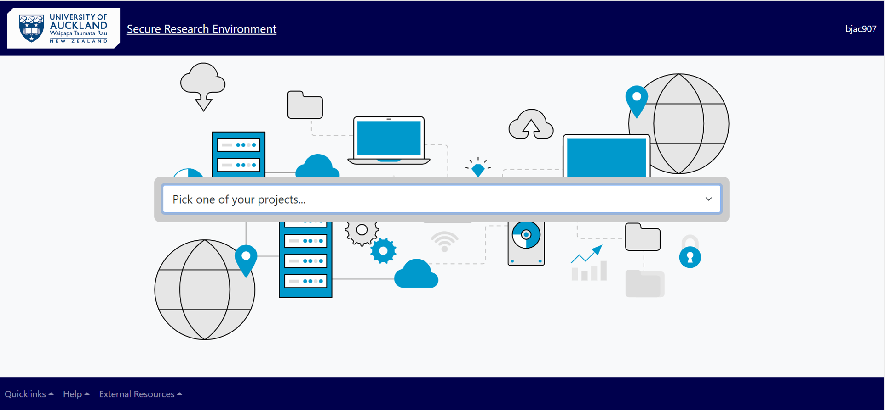
  <figcaption> </figcaption>
</figure>

In the landing page, select your project from the drop-down menu. All the projects you have access to will be displayed in the drop-down. Select the one you need to work with. 

<figure markdown>
  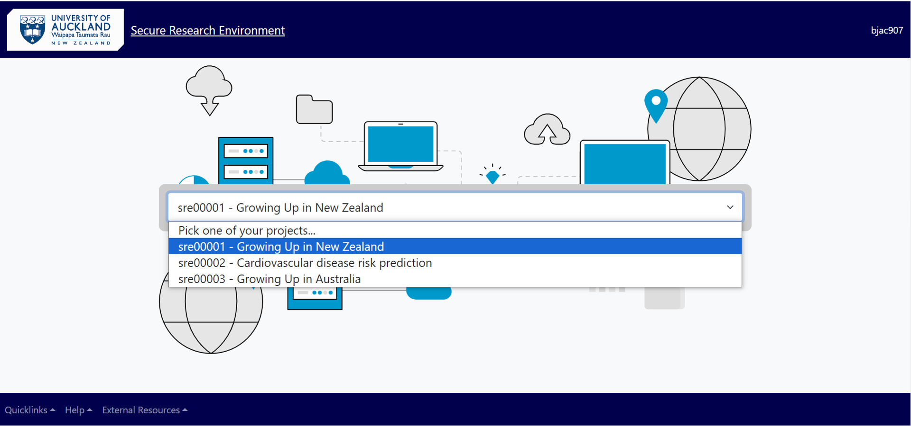
  <figcaption> </figcaption>
</figure>

## Analysing Data 

From the project’s main menu, choose Virtual desktop if you need to access and work with the data in your personal folder or shared project folders. 

<figure markdown>
  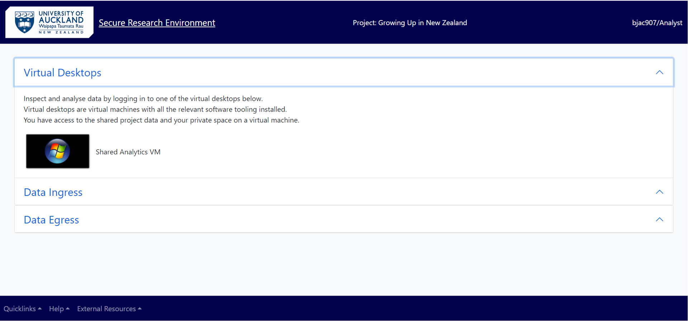
  <figcaption> </figcaption>
</figure>

Choose from either the Windows Research VM or Linux Research VM. This will log you into the virtual machine which have the relevant software tools installed for your analysis. 

Click on the File Explorer from the task bar at the bottom of virtual desktop, to choose the folder you want. 

<figure markdown>
  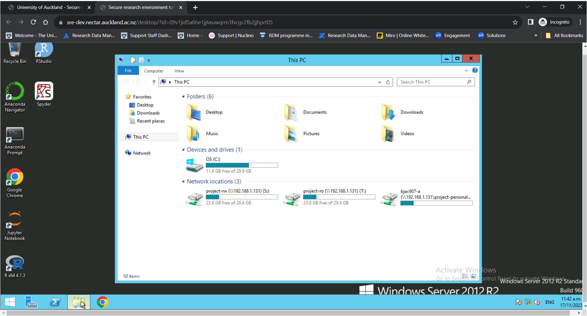
  <figcaption> </figcaption>
</figure>

### Storage structure for researcher 

Each researcher has access to three folders- one personal folder (with read-write access) and two shared project folders (with read-only and read-write access respectively). 

Click on the folder which have the data you need to work with. 

For data custodian’s folder structure, go to section () 

## Opening software and running analysis 

Select your software from the desktop and open the datasets you need to work with from your personal or project’s shared folder. The files and folders can be accessed through clicking on “This PC” and choosing the appropriate folder under “Network locations”.
 
<figure markdown>
  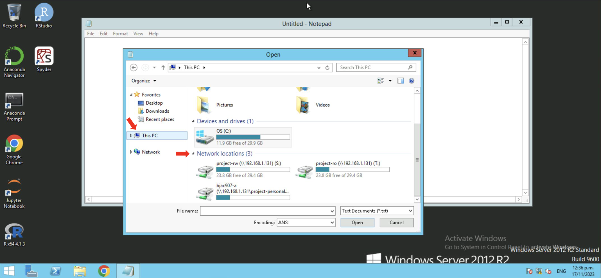
  <figcaption> </figcaption>
</figure>

After finishing the analysis, “Save” your work in the appropriate folder (see the next section on “Save data”). 

If your software is not available in the desktop, click on the Search icon in the task bar, type in and select the software you need. 

<figure markdown>
  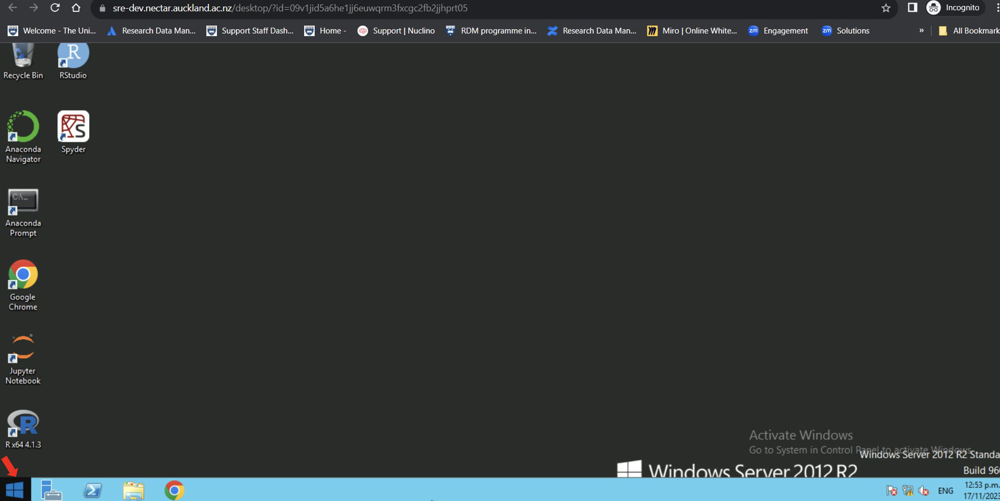
  <figcaption> </figcaption>
</figure>

### Save data into different folders (personal, shared, egress) 

Once the analysis is done, choose “project-rw” or your personal folder and press “Save” to store your data. If you want to egress your analysed data out of the SRE, follow instruction under Data Egress (link).

<figure markdown>
  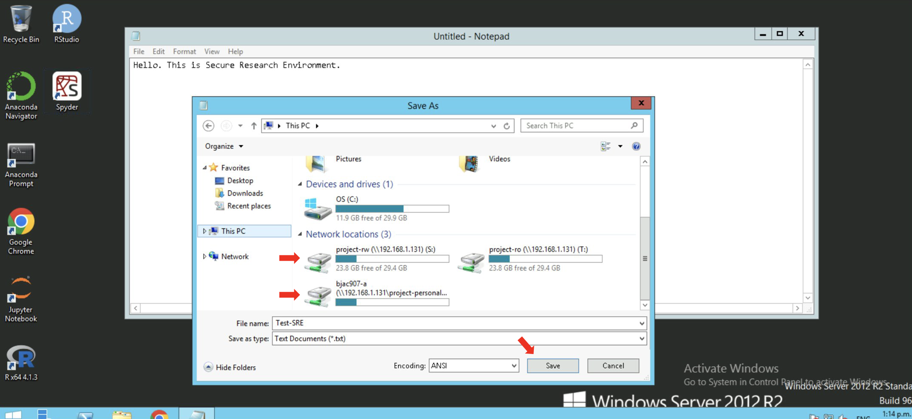
  <figcaption> </figcaption>
</figure>

Note: In SRE, as a “Researcher” you cannot save a file in “project-ro” folder. Saving your files on VM’s “Desktop” and “Documents” folders is **not recommended** as the VMs are replaceable and the data you have saved there could be lost. 

### Access data from shared or read-only folder 
Only the data custodian can edit the data in a project's RO folder. The researchers can access the data and can analyse it to generate outputs but cannot edit its content.

### Request Ingress/Import Data 
As a researcher to upload files from your computer or a location outside of Secure Research Environment, you need to use “Data Ingress” Option from the project’s main menu. 
 
<figure markdown>
  
  <figcaption> </figcaption>
</figure>

This feature allows your files to be copied into a staging area and a request can be made to ingress (import) the files into your personal folder in SRE. This is a two-step process.  

(i) Choose the file and upload it into the staging area.  Please note the maximum size is 1 GB per file but you can choose and upload multiple files at a go.  
You can also zip up a file and upload it, but then the size of the zipped folder should be less than 1 GB. 

<figure markdown>
  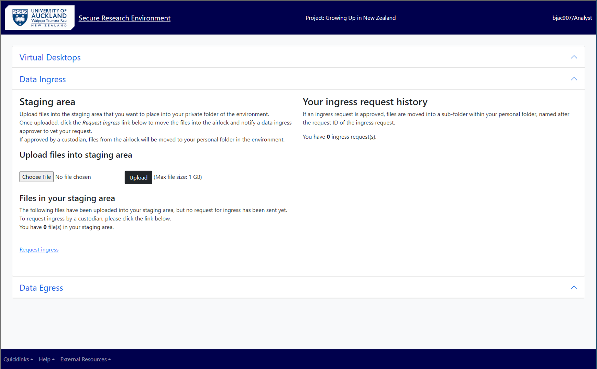
  <figcaption> </figcaption>
</figure>

(ii) Click on the “Request ingress”. This moves the files into the airlock and a notification is sent to you and the ingress approver to evaluate your request. 

<figure markdown>
  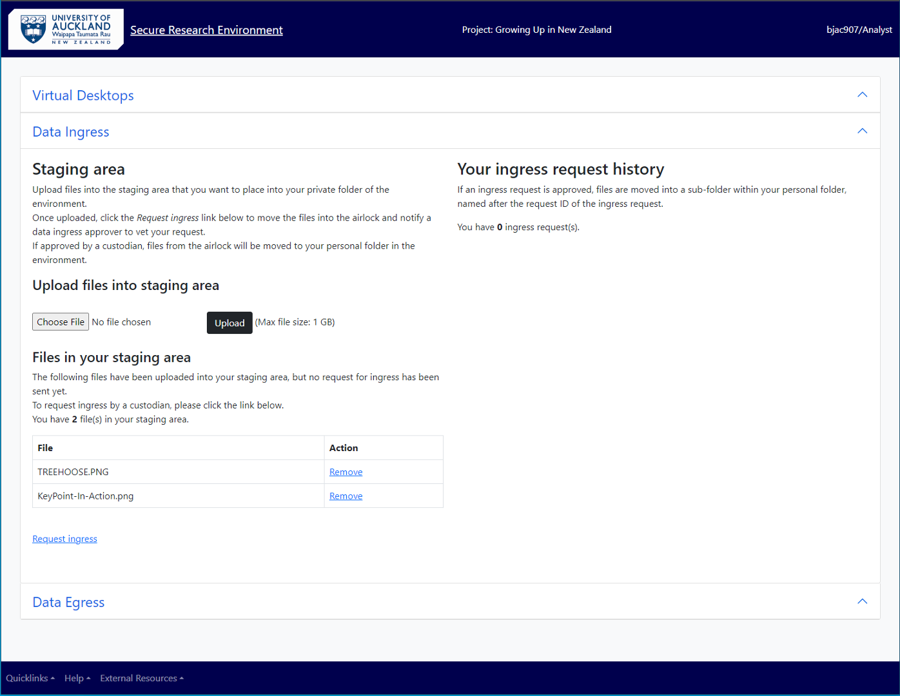
  <figcaption> </figcaption>
</figure>

<figure markdown>
  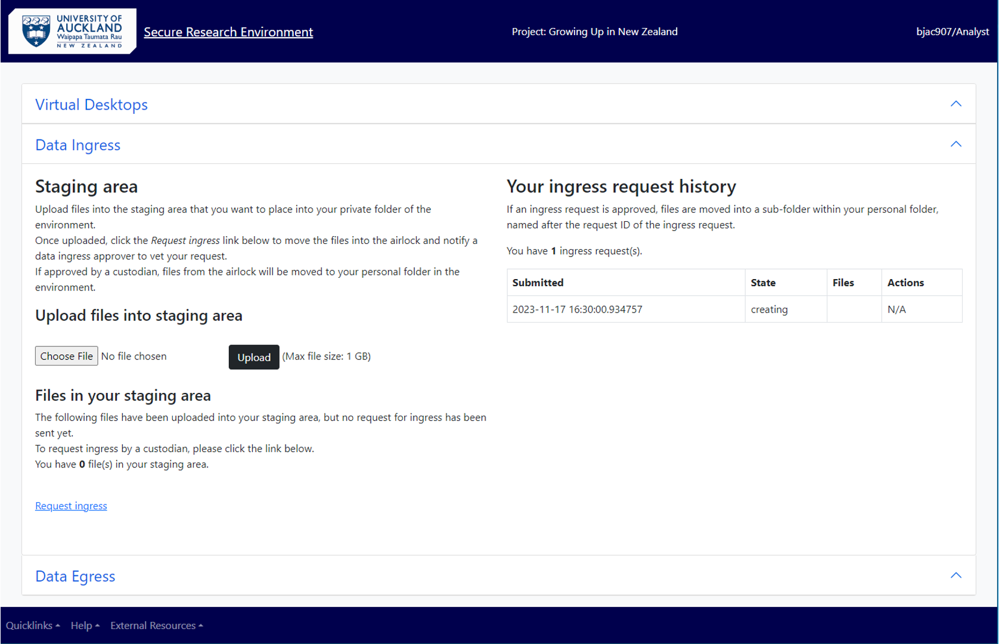
  <figcaption> </figcaption>
</figure>

(In the ingress request history, you will see the request state changed from “creating” to “pending_approval”). 

<figure markdown>
  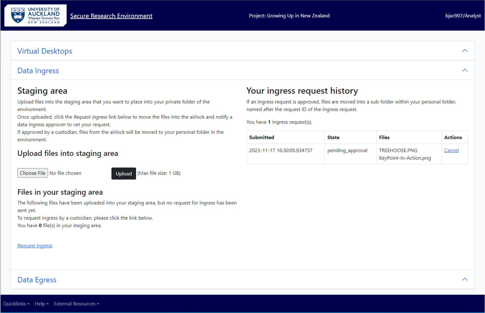
  <figcaption> </figcaption>
</figure>

Following the ingress approver/data custodian’s evaluation of the data, if the request is approved, state of the request changes to “approved” and you will receive a notification of the same. The files will be moved from the airlock into “ingress” inside your personal folder.  

<figure markdown>
  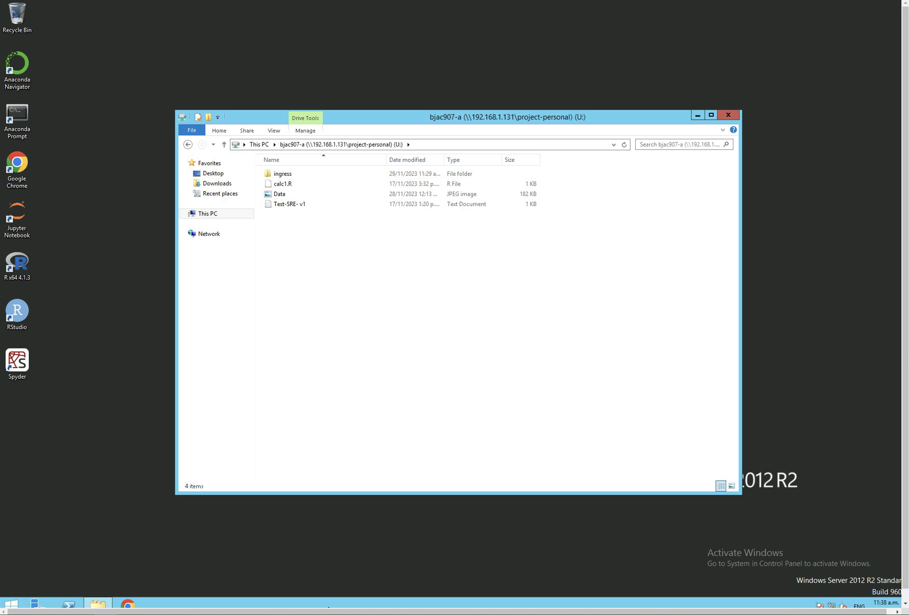
  <figcaption> </figcaption>
</figure>

<figure markdown>
  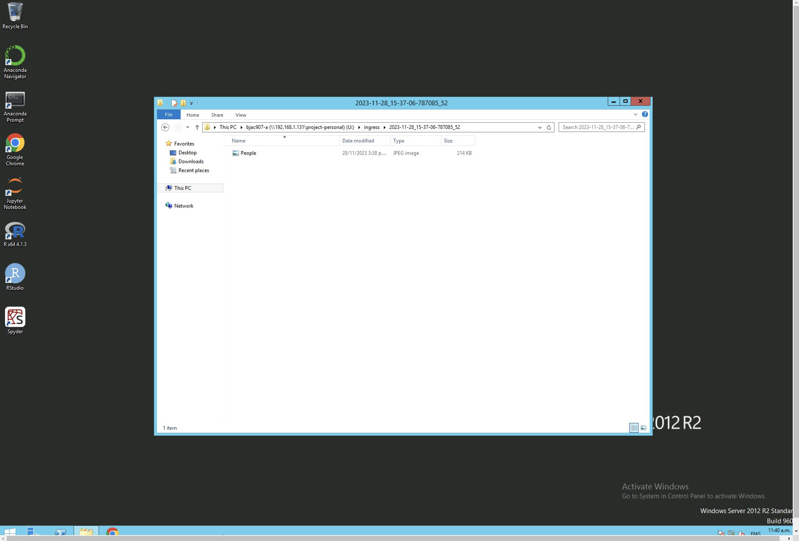
  <figcaption> </figcaption>
</figure>

You can either keep the imported file in your personal folder or copy it into the “project-rw” folder to share and collaborate with rest of your team. 

If the Ingress Approver rejects your request, state of the request changes to “rejected” and the file is deleted from the staging area. You can contact the Approver for a clarification and seek advice on the next steps.   

###Request Egress/Export Data 
TBD

###Time outs 

The VM connection will be closed once the idle timeout has been reached. 10 minutes of inactivity will lead to connection to the VM being lost and you may need to refresh the environment/log in again to continue. 

<figure markdown>
  
  <figcaption> </figcaption>
</figure>

###Change a role for the project in SRE 

You can change your role (if you have been given multiple roles by the SRE team at the discretion of data custodian) by selecting an option from the dropdown menu at the rightmost corner of the main menu.  

<figure markdown>
  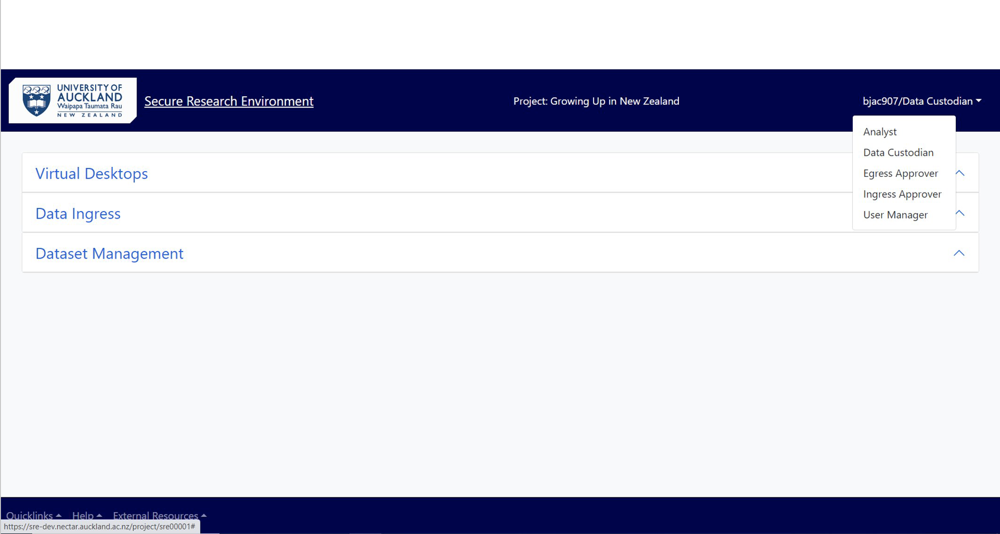
  <figcaption> </figcaption>
</figure>

You can choose one of the four options according to your requirement in the project. Please contact your project owner/data custodian if you need to access SRE with a different role (only the project owner/data custodian can request SRE team to assign various roles to different users in SRE). 

##As a Data Custodian 

###Log into SRE  

Open (incognito?) browser
 
[Enter SRE URL/domain](https://sre.nectar.auckland.ac.nz/)  

[For test](https://sre-dev.nectar.auckland.ac.nz/) 

In the log in page, enter UPI and password (in testing phase – password set for the test environment) 

Enter MFA (in testing phase – token for test authy) 

You will see the following landing page. Choose “Virtual Desktops” if you need to analyse your data. Following instructions as above (point to previous sections). 

<figure markdown>
  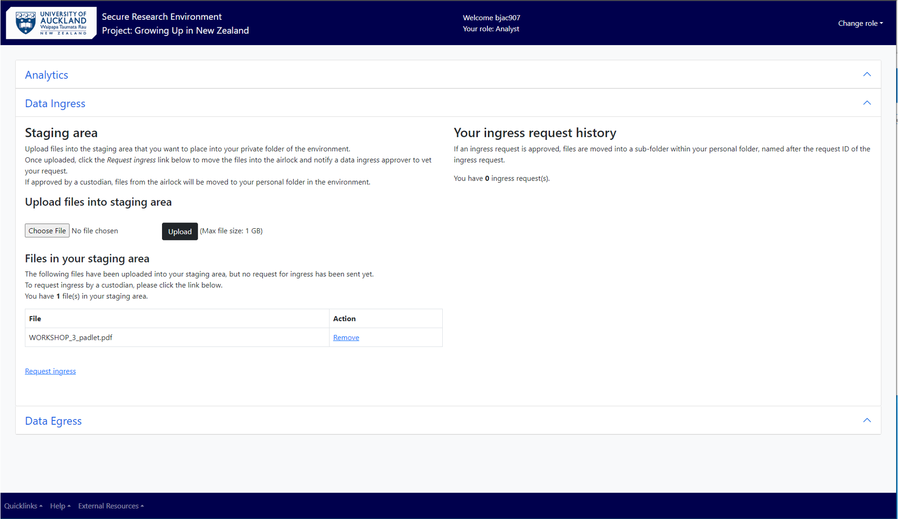
  <figcaption> </figcaption>
</figure>

###Storage structure for Data Custodian 

The following are the list of folders a data custodian has access to: 

Project-rw - Shared project folder with read and write access.  
The content in this folder can be edited by the users who have access to it. 

Project-ro – Shared project folder with read only access.  
The data in this folder cannot be manipulated by anyone except data custodian. 

Project-personal – Personal folders of each user in the project will be listed in this folder.  
The data custodian can access any of these users’ personal folder to view/update/delete data in an SRE. 

Custodian – Only data custodian has access to this folder.  
When a data custodian ingress data directly, the uploaded files are moved into this folder and the data custodian can then move these files into project-rw, project personal (username) or egress-approver folder. 

Egress approver - Folder where all the egress request files land in. 
Both data custodian and egress approver have access to this folder. 

Ingress approver – Folder where all the ingress request files land in. 
Both data custodian and ingress approver have access to this folder. 

<figure markdown>
  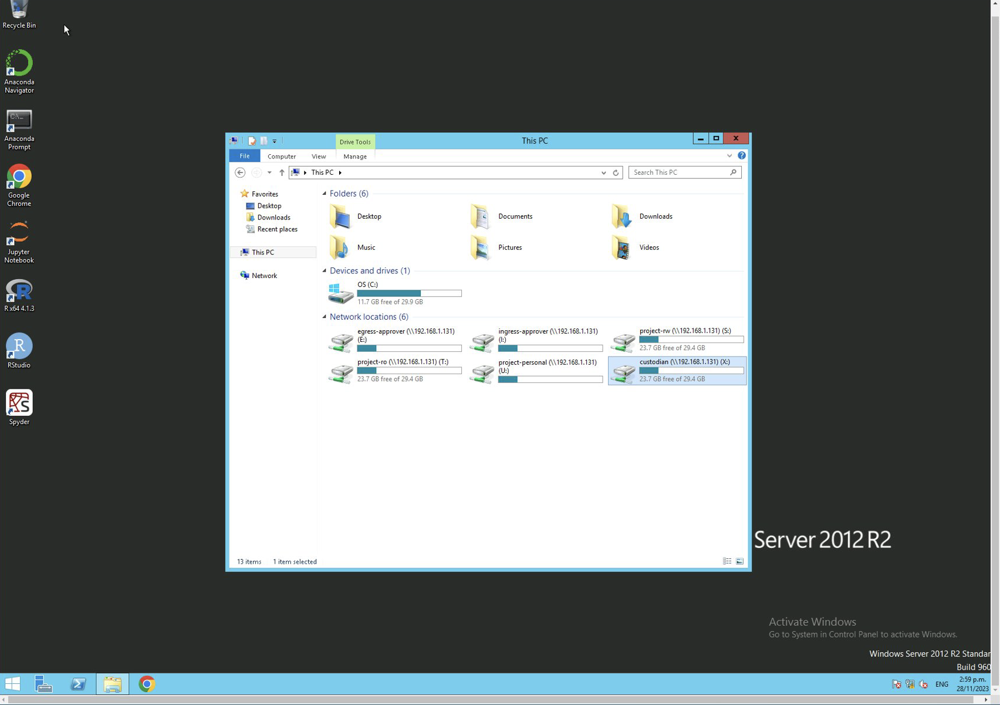
  <figcaption> </figcaption>
</figure>

###Ingress data directly into SRE 

A data custodian can import (ingress) data directly into SRE without requiring approval from the ingress approver.  

For this, in the main menu select “Data Ingress” and “choose the file” to be uploaded and click on “Upload”. This copies your file from your computer/storage device to the airlock.  

<figure markdown>
  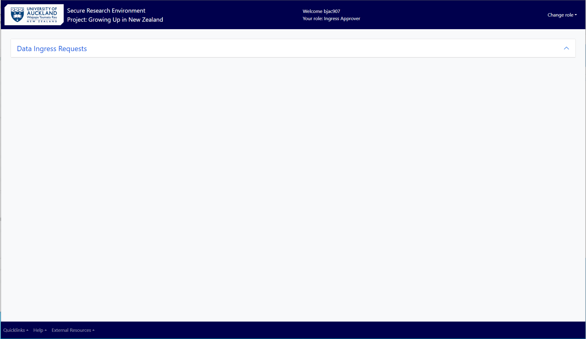
  <figcaption> </figcaption>
</figure>

Select “Request ingress” to move the file from the airlock to “Custodian” folder. The request state in the “ingress request history” changes from “creating” to “completed”. 

You will also receive two notifications in your email - your file has been uploaded and then that it has been processed. 

###Deletion of datasets 

As a data custodian, you have read and write access to every folder in your project in an SRE. You may delete data from user’s personal, custodian, ingress-approver, egress-approver, project-ro and project-rw folders. 

###Request for change of user’s role/permission level 

As a data custodian, you can request for a specific user’s role to be changed in your project or give them a different permission level (read-write or read-only) in SRE. For this, please send an email to the SRE team. 

###Request to remove a user from a project 

As a data custodian, you can request for a specific user to be added or deleted from your project in SRE. Please send an email to the SRE team with the users' details – full name, UPI, email and role in SRE (researcher/data custodian/ingress-approver/egress-approver). 

##As a data ingress approver 

Login as in section () or change to “Ingress approver” role (section) 

###View ingress requests 

Upon getting the notification to review an ingress files request, the user must either log in to SRE environment as an Ingress Approver/Data custodian or needs to select and change the role in SRE.  

Select Data Ingress Request from the screen.  

<figure markdown>
  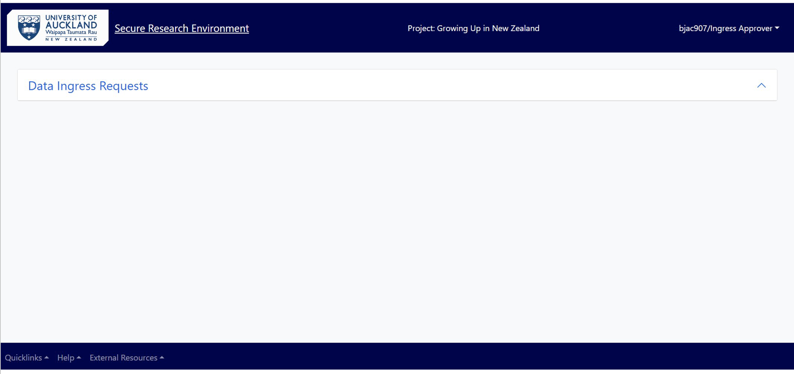
  <figcaption> </figcaption>
</figure>

You can see the requests by different users which are waiting to be approved.  You can use the virtual machine available to view and evaluate the data been requested to be brought in. 

<figure markdown>
  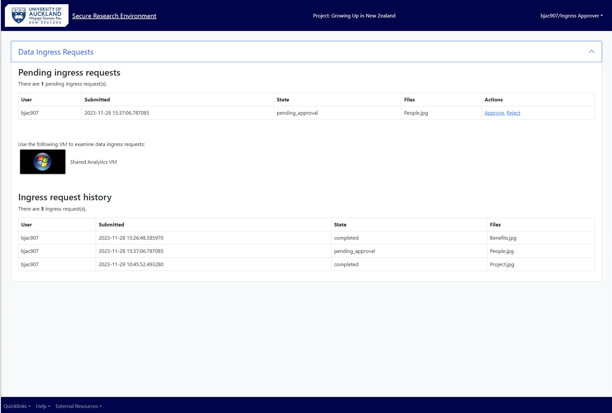
  <figcaption> </figcaption>
</figure>

In the virtual machine, open the File explorer and select “ingress-approver” folder under network locations. 

<figure markdown>
  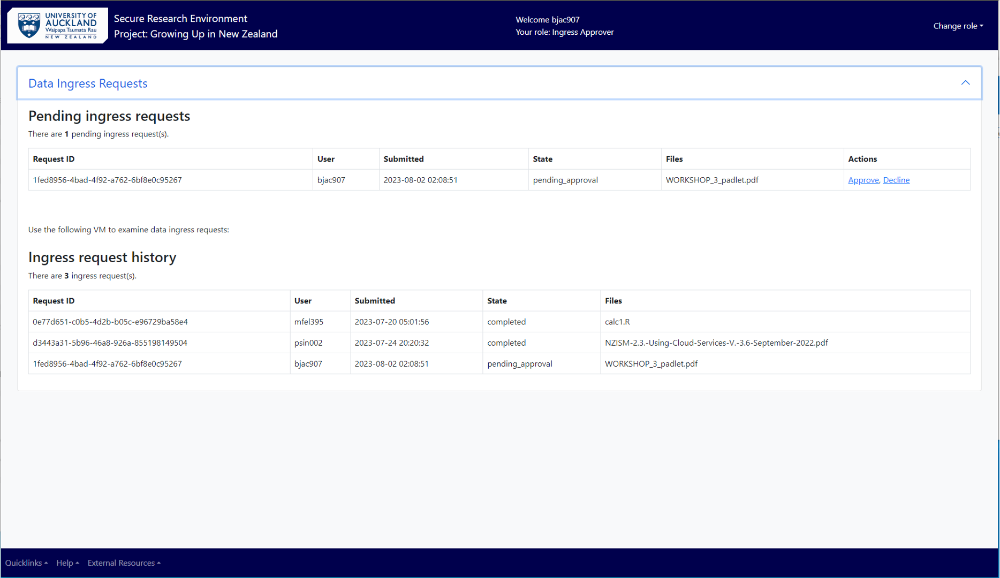
  <figcaption> </figcaption>
</figure>

From the list of folders, select the user who requested the ingress, and open the requested file to inspect the contents.  

###Approve or decline a request 

After inspection, go back to the previous main menu (Data ingress requests) and approve or reject the ingress request, as seen appropriate. The data will be automatically deleted from the ingress approver folder (airlock) following approval/rejection. If the request is approved, you will find the file in your personal storage (folder) in the “ingress” folder. 

##As a data egress approver 

###View egress requests 

TBD 
