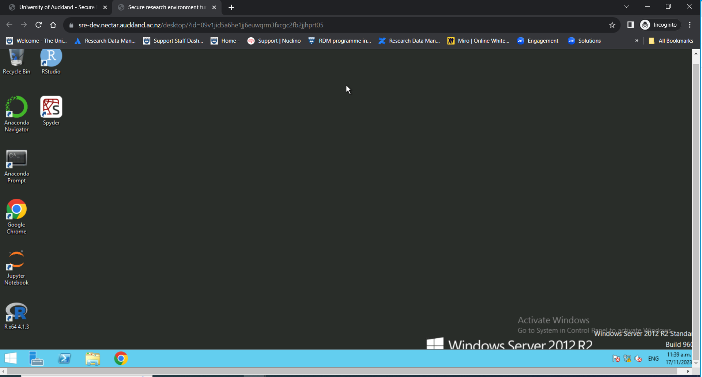
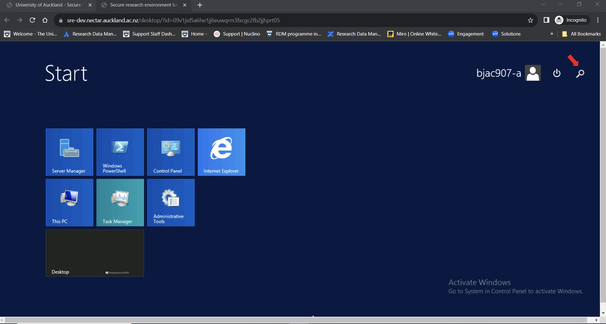
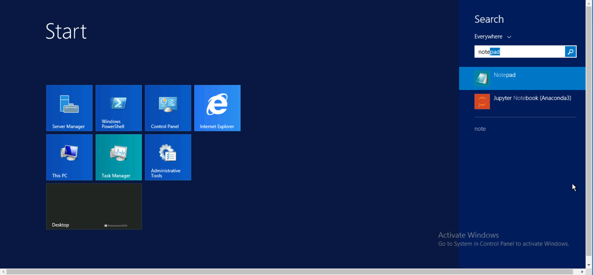

#Using On-Prem SRE 

##As a Researcher

###Log into the SRE 

Open (incognito?) browser
 
[Enter SRE URL/domain](https://sre.nectar.auckland.ac.nz/)  

[For test](https://sre-dev.nectar.auckland.ac.nz/) 

In the log in page, enter UPI and password (in testing phase - password set for the test environment) 
Enter MFA (in testing phase – token for test authy) 

###Working in Analysis Environment as a Researcher 
             You will come to the landing page. 

<figure markdown>
  
  <figcaption> </figcaption>
</figure>

In the landing page, select your project from the drop-down menu. All the projects you have access to will be displayed in the drop-down. Select the one you need to work on. 

<figure markdown>
  
  <figcaption> </figcaption>
</figure>

<figure markdown>
  
  <figcaption> </figcaption>
</figure>

From the project’s main menu, choose Virtual desktop if you need to access data in your personal folder or shared project folders. 

<figure markdown>
  
  <figcaption> </figcaption>
</figure>

###Analysing Data 
To access the data, you have permission to work on, click on the “Shared analytics VM” or your customised VM. This will log you into the virtual machine which have the relevant software tools installed. 

<figure markdown>
  
  <figcaption> </figcaption>
</figure>

Click on the File Explorer from the task bar at the bottom of virtual desktop, to choose the folder you want. 

<figure markdown>
  
  <figcaption> </figcaption>
</figure>

Each user has access to three folders- one personal folder (with read-write access) and two shared project folders (with read-only and read-write access respectively). 

Click on the folder which have the data you need to work with. 
 
###Opening software and running analysis 
Select your software from the desktop and open the datasets you need to work with from your personal or project’s shared folder. The files and folders can be accessed through clicking on “This PC” and choosing the appropriate folder under “Network locations”.
 
<figure markdown>
  
  <figcaption> </figcaption>
</figure>

<figure markdown>
  
  <figcaption> </figcaption>
</figure>

After finishing the analysis, “Save” your work in the appropriate folder (see the next section on “Save data”). 

If your software is not available in the desktop, click on the Windows icon at the leftmost corner in the task bar and type in your search in the search bar and select the software you need. 

<figure markdown>
  
  <figcaption> </figcaption>
</figure>

<figure markdown>
  
  <figcaption> </figcaption>
</figure>

<figure markdown>
  
  <figcaption> </figcaption>
</figure>

###Save data into different folders (personal, shared, egress) 
Once the analysis is done, choose “project-rw” or your personal folder and press “Save” to store your data. 

<figure markdown>
  
  <figcaption> </figcaption>
</figure>

Note: In SRE, as a “Researcher” you cannot save a file in “project-ro” folder. Saving your files on VM’s “Desktop” and “Documents” folders is **not recommended** as the VMs are replaceable and the data you have saved there could be lost. 

###Access data from shared or read-only folder 
TBD 

###Request Ingress/Import Data 
As a researcher to upload files from your computer or a location outside of Secure Research Environment, you need to use “Data Ingress” Option from the project’s main menu. 
 
<figure markdown>
  
  <figcaption> </figcaption>
</figure>

This feature allows your files to be copied into a staging area and a request can be made to ingress (import) the files into your personal folder in SRE. This is a two-step process.  

(i) Choose the file and upload it into the staging area.  Please note the maximum size is 1 GB per file but you can choose and upload multiple files at a go.  
You can also zip up a file and upload it, but then the size of the zipped folder should be less than 1 GB. 

<figure markdown>
  
  <figcaption> </figcaption>
</figure>

(ii) Click on the “Request ingress”. This moves the files into the airlock and a notification is sent to you and the ingress approver to evaluate your request. 

<figure markdown>
  
  <figcaption> </figcaption>
</figure>

<figure markdown>
  
  <figcaption> </figcaption>
</figure>

(In the ingress request history, you will see the request state changed from “creating” to “pending_approval”). 

Following the data custodian’s evaluation of the data, if the request is approved, state of the request changes to “approved” and you will receive a notification of the same. The files will be moved from the airlock into your personal folder. You can either keep the imported file in your personal folder or copy it into the “project-rw” folder to share and collaborate with rest of your team. 

If the Ingress Approver rejects your request, state of the request changes to “rejected” and the file is deleted from the staging area. You can contact the Approver for a clarification and seek advice on the next steps.   

###Request Egress/Export Data 

###Time outs 

##As a Data Custodian 

###Log into SRE [same as above] 

###Select data custodian role for project [depends on role as to default role] 

###View ingress/egress requests 

###Approve or decline a request 

###Request for change of user’s role/permission level 

###Request to remove a user from a project 

###Deletion of datasets 