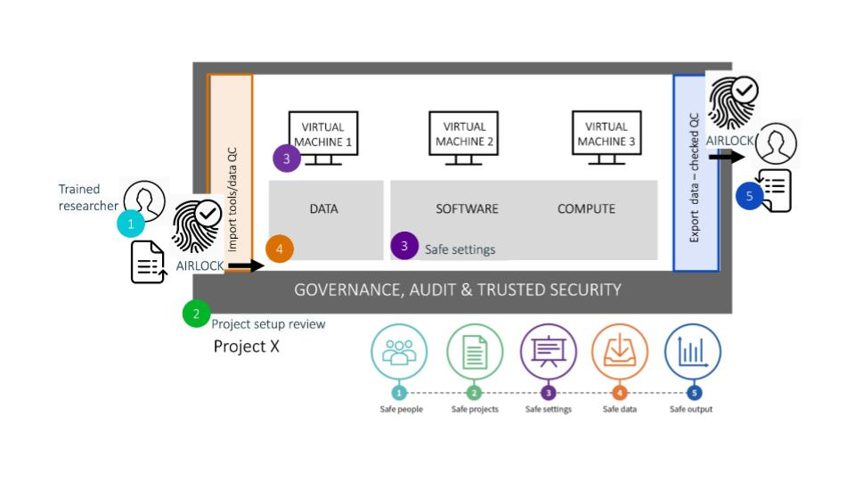

#Introduction to SRE 
Secure research environment (SRE) provides a safe, remote computing environment for approved researchers to work collaboratively and analyse sensitive data augmented with layers of governance and auditing. The data which is brought into SRE and the analysed results which can be derived or exported from the environment is vetted by the authorised research team member to control the access to the sensitive information. Such monitored systems keep data safe while preventing misuse of data. 

!!The diagram will change!!

<figure markdown>
  
  <figcaption> </figcaption>
</figure>

-[SRE]: Secure Research Environment  
